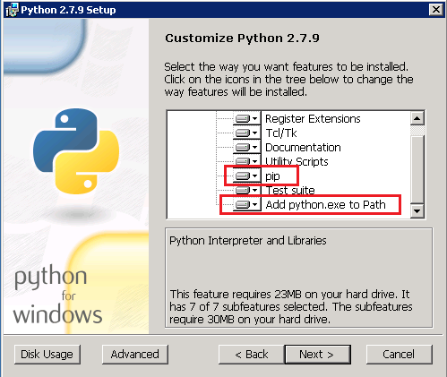
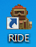
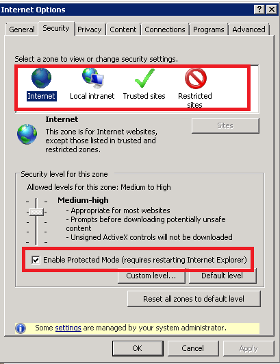
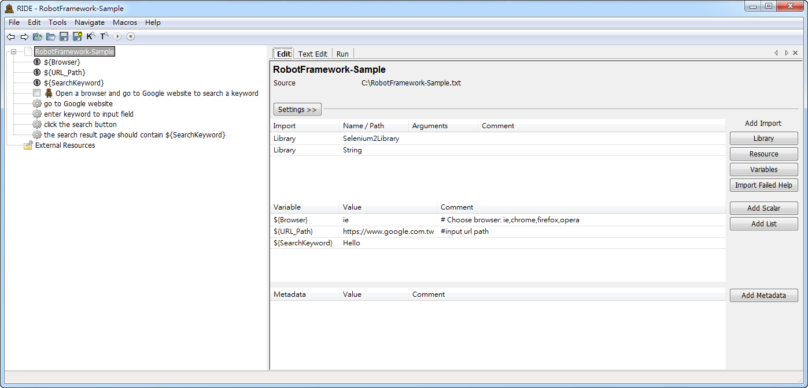
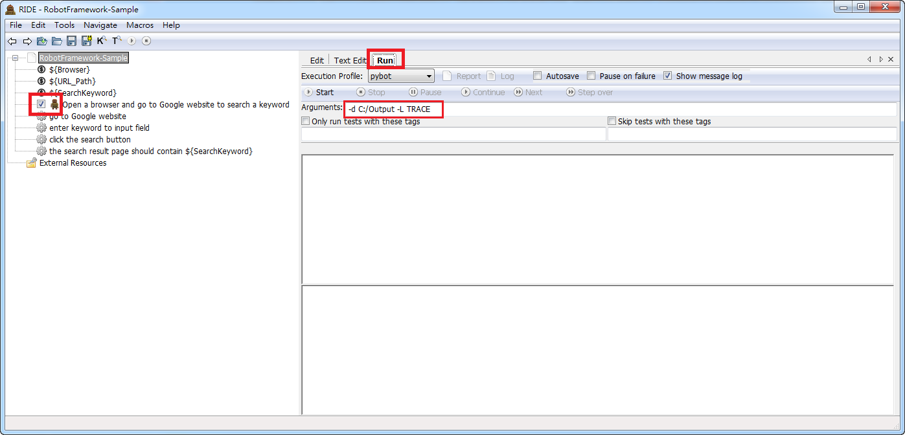
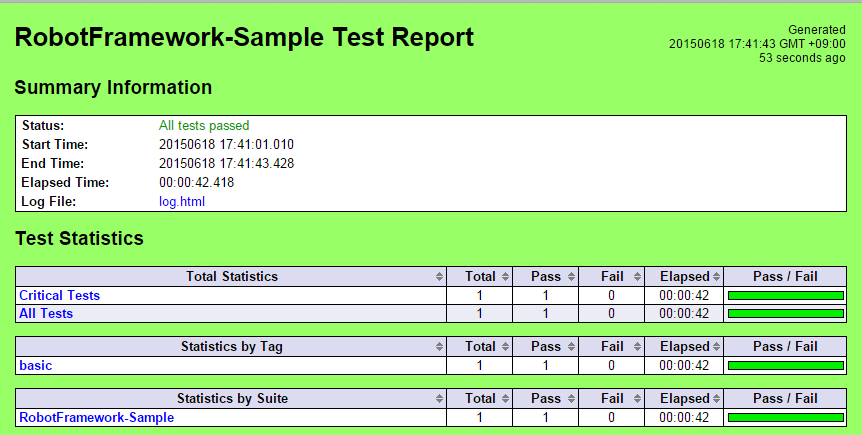

※ Install Robot Framework Steps
================================
----
1. Source: http://git.jarvis.trendmicro.com/TestMercenary/RFLibrary/tree/master/

2. Install **1-python-2.7.9.msi**
  - Let **pip** and **Add python.exe to path** installed to local hard drive
  - 
  - 

3. Install **2-wxPython2.8-win32-unicode-2.8.12.1-py27.exe**

4. Execute **3-Install_RF_Library_and_RIDE.bat** (run as administator)

5. Install **4-pyodbc-3.0.7.win32-py2.7.exe**

6. Copy web drivers for robot framework
  - Download **the lastet release** web driver form the website
  - ChromeDriver : https://sites.google.com/a/chromium.org/chromedriver/downloads
  - The Internet Explorer Driver Server : http://www.seleniumhq.org/download/
  - Unzip webdrivers files
  - Copy **IEDriverServer.exe** and **chromedriver.exe** to **C:\Python27\Scripts**

7. Copy python files from **ImapLibrary** and **Databaselibrary** folders to **C:\Python27\Lib\site-packages\${LibraryName}\**
    - **PS. Use new python files to replace original python file**
        - http://git.jarvis.trendmicro.com/TestMercenary/RFLibrary/tree/master/ImapLibrary
        - http://git.jarvis.trendmicro.com/TestMercenary/RFLibrary/tree/master/DatabaseLibrary

8. Copy **RIDE.lnk** to your computer, it's a shortcut to open RIDE editor for edit robotframework files
  - 
 
9. Enable IE Protected Mode when run auto test using IE browser
  - **[Enable Protected Mode]** 4 items as following of **[Security]** tab in **IE [Internet Options]**
      1. **Internet**
      2. **Local Intranet**
      3. **Trusted sites**
      4. **Restricted sites** 
  - 

※ Documentation
================
----
1. http://robotframework.org/robotframework/
2. http://robotframework.org/robotframework/latest/libraries/BuiltIn.html
3. http://robotframework.org/Selenium2Library/doc/Selenium2Library.html

※ Best Practice
================
----
1. Source: http://git.jarvis.trendmicro.com/TestMercenary/RFLibrary/tree/master/RobotFramework-Sample.txt

2. Open **RIDE** editor and click **[Open Test Suite]** to open **RobotFramework-Sample.txt**
  - 

3. You will see as following picture
  - 

4. Run the first test case via RIDE
  1. Check the first test case :white_check_mark: **_Open a browser and go to Google website to search a keyword_**
  2. Click **[Run]** tab
  3. Enter the arguments **[-d C:/Output -L TRACE]** It means your test report will be save to **C:/Output** and **log more information** for this test
  4. 

5. You should be see that **IE browser** be opened and go to Google website to search a keyword. If the test passed, the RIDE editor as following
  - 

6. You can click **[Report]** button to see this test report. The report page as following
  - 